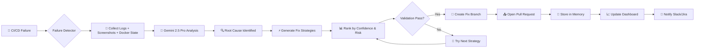

# 🔮 GeminiGuard: Autonomous Self-Healing CI/CD Agent

> **Your CI/CD pipeline's autonomous guardian.**

GeminiGuard is an AI-powered agent that doesn't just *detect* CI/CD failures — it **understands, diagnoses, and heals them autonomously**. Powered by Google Gemini 2.5 Pro's 1M context window and multi-modal capabilities, it analyzes everything from build logs to UI test screenshots, generates fix PRs automatically, and learns from every resolution to prevent future regressions.

**What makes it different:** Unlike tools that only suggest fixes in comments, GeminiGuard creates actual fix branches, opens PRs, tracks API costs transparently, and integrates with Slack and Jira — all while building a memory of past failures to improve over time.


# 🚀 GeminiGuard: Autonomous Self-Healing CI/CD Agent

GeminiGuard is an AI-powered CI/CD automation system that detects pipeline failures, analyzes root causes using Google Gemini, and autonomously applies safe, ranked fixes.

---

## ✨ Features

- 🔍 Root Cause Analysis using Gemini 1.5 Pro
- 🧠 Multi-strategy fix generation with function calling
- 📊 Fix ranking based on confidence & risk
- ✅ Automated validation with test execution
- 🔄 Self-learning memory system
- 🖥 Observability dashboard (Streamlit)
- 🔐 Safe execution and rollback-ready design

---

## 🏗 Architecture

1. Failure detected from CI/CD
2. Gemini analyzes logs
3. Generates structured fix strategies
4. Rank fixes
5. Apply fix
6. Validate via tests
7. Store learning

---

## 🚀 Getting Started

### 1. Clone the repo

```bash
git clone https://github.com/yourusername/geminiguard-cicd.git
cd geminiguard-cicd

<div align="center">

<pre>
 ██████╗ ███████╗███╗   ███╗██╗███╗   ██╗██╗ ██████╗ ██╗   ██╗ █████╗ ██████╗ ██████╗ 
██╔════╝ ██╔════╝████╗ ████║██║████╗  ██║██║██╔════╝ ██║   ██║██╔══██╗██╔══██╗██╔══██╗
██║  ███╗█████╗  ██╔████╔██║██║██╔██╗ ██║██║██║  ███╗██║   ██║███████║██████╔╝██║  ██║
██║   ██║██╔══╝  ██║╚██╔╝██║██║██║╚██╗██║██║██║   ██║██║   ██║██╔══██║██╔══██╗██║  ██║
╚██████╔╝███████╗██║ ╚═╝ ██║██║██║ ╚████║██║╚██████╔╝╚██████╔╝██║  ██║██║  ██║██████╔╝
 ╚═════╝ ╚══════╝╚═╝     ╚═╝╚═╝╚═╝  ╚═══╝╚═╝ ╚═════╝  ╚═════╝ ╚═╝  ╚═╝╚═╝  ╚═╝╚═════╝ 
</pre>

<h3>🛡️ Your CI/CD Pipeline's Autonomous Guardian</h3>

<p>
  
  
  
  
  
  
</p>

<p><i>Detects failures. Diagnoses root causes. Generates fixes. Opens PRs. Learns from every mistake.</i></p>

</div>

---

## 📋 Table of Contents

- [Why GeminiGuard?](#why-geminiguard)
- [✨ Features](#-features)
- [🏗 Architecture](#-architecture)
- [🚀 Quick Start](#-quick-start)
- [🔧 Configuration](#-configuration)
- [💰 Cost Transparency](#-cost-transparency)
- [🔌 Integrations](#-integrations)
- [📊 Dashboard](#-dashboard)
- [🤝 Contributing](#-contributing)
- [🗺 Roadmap](#-roadmap)
- [📜 License](#-license)

---

## Why GeminiGuard?

<div align="center">

| 😫 **The 2 AM Nightmare** | 🚀 **The GeminiGuard Way** |
|:---|:---|
| Pipeline fails. You wake up. | Pipeline fails. GeminiGuard wakes up. |
| Scroll through 10,000 lines of logs. | Analyzes logs, screenshots, and Docker state in seconds. |
| Guess the root cause. | Pinpoints the exact issue with confidence score. |
| Manually patch and pray. | Generates a fix, validates it, and opens a PR. |
| Same bug breaks again next week. | Remembers the fix. Prevents regression forever. |

</div>

**Unlike other tools** that only suggest fixes in PR comments, **GeminiGuard creates actual fix branches, opens real PRs, and tracks every API dollar spent** — all while building a memory of past failures to improve over time.

---

## ✨ Features

<div align="center">

| Feature | Description | Emoji |
|:---|:---|:---:|
| **Multi-Modal Analysis** | Reads logs, test outputs, Docker states, **and UI screenshots** | 🔍 |
| **Autonomous PR Generation** | Creates fix branches and opens pull requests automatically | 🤖 |
| **Fix Ranking Engine** | Ranks fixes by confidence, risk, and blast radius | 📊 |
| **Safe Execution** | Dry-run mode, rollback-ready, never pushes to `main` directly | 🔐 |
| **Self-Learning Memory** | Vector DB stores every failure → fix pair for future prevention | 🧠 |
| **Cost Transparency** | Real-time API cost tracking per operation, per pipeline | 💰 |
| **Streamlit Dashboard** | Live observability into agent decisions and pipeline health | 📈 |
| **Slack & Jira** | Instant alerts, ticket creation, and threaded discussions | 🔌 |

</div>

---

## 🏗 Architecture



---

## 🚀 Quick Start

### 1. Clone & Install

```bash
git clone https://github.com/iampraveen6/GeminiGuard-Autonomous-Self-Healing-CI-CD-Agent.git
cd GeminiGuard-Autonomous-Self-Healing-CI-CD-Agent
pip install -r requirements.txt
```

### 2. Configure Environment

```bash
cp .env.example .env
```

Edit `.env`:

```env
# Required
GEMINI_API_KEY=your_gemini_api_key_here
GITHUB_TOKEN=ghp_your_github_token

# Optional Integrations
SLACK_WEBHOOK_URL=https://hooks.slack.com/services/...
JIRA_BASE_URL=https://your-domain.atlassian.net
JIRA_EMAIL=you@example.com
JIRA_API_TOKEN=your_jira_token

# Agent Settings
GEMINIGUARD_DRY_RUN=true          # Set false to enable live PR creation
GEMINIGUARD_MAX_COST_USD=5.00     # Auto-stop if cost exceeds this
GEMINIGUARD_CONFIDENCE_THRESHOLD=0.85
```

### 3. Run Your First Scan

```bash
# Analyze a failed CI log file
python -m geminiguard analyze --log-file ./sample-failure.log --screenshot ./error.png

# Or start the dashboard
streamlit run dashboard/app.py
```

---

## 🔧 Configuration

### GitHub Actions Integration

```yaml
# .github/workflows/geminiguard.yml
name: GeminiGuard Self-Healing

on:
  workflow_run:
    workflows: ["CI"]
    types: [completed]

jobs:
  heal:
    if: ${{ github.event.workflow_run.conclusion == 'failure' }}
    runs-on: ubuntu-latest
    steps:
      - uses: actions/checkout@v4
      - name: Run GeminiGuard
        uses: iampraveen6/geminiguard-action@v1
        with:
          gemini-api-key: ${{ secrets.GEMINI_API_KEY }}
          github-token: ${{ secrets.GITHUB_TOKEN }}
          dry-run: false
```

### GitLab CI Integration

```yaml
# .gitlab-ci.yml
geminiguard_heal:
  stage: .post
  script:
    - pip install geminiguard
    - geminiguard analyze --ci-provider gitlab
  rules:
    - if: $CI_PIPELINE_SOURCE == "push" && $CI_COMMIT_BRANCH
      when: on_failure
```

---

## 💰 Cost Transparency

<div align="center">

| Operation | Input Tokens | Output Tokens | Est. Cost (USD) |
|:---|---:|---:|---:|
| Log Analysis (10K lines) | ~15K | ~2K | $0.08 |
| Screenshot + Log Diagnosis | ~25K (multimodal) | ~3K | $0.15 |
| Fix Generation (single strategy) | ~8K | ~4K | $0.06 |
| Fix Ranking (3 strategies) | ~20K | ~1K | $0.05 |
| Full Pipeline (avg. failure) | ~50K | ~10K | **~$0.35** |
| Complex Multi-File Bug | ~100K | ~20K | **~$0.75** |

*Based on Gemini 2.5 Pro pricing as of June 2026. Costs tracked in real-time via dashboard.*

</div>

---

## 🔌 Integrations

<div align="center">

| Platform | Status | Setup |
|:---|:---:|:---|
| **GitHub Actions** | ✅ Ready | Use provided workflow template |
| **GitLab CI** | ✅ Ready | Add `.gitlab-ci.yml` snippet |
| **Slack** | ✅ Ready | Add `SLACK_WEBHOOK_URL` to `.env` |
| **Jira** | ✅ Ready | Add Jira credentials to `.env` |
| **Azure DevOps** | 🚧 In Progress | See Roadmap |
| **CircleCI** | 🚧 In Progress | See Roadmap |

</div>

---

## 📊 Dashboard

Launch the Streamlit observability dashboard:

```bash
streamlit run dashboard/app.py
```

**Features:**
- 📈 Real-time pipeline health metrics
- 💸 Live API cost tracking
- 🧠 Memory browser (past failures & fixes)
- 🔍 Decision audit trail (why GeminiGuard chose Fix A over Fix B)
- 🔔 Integration status monitor

---

## 🤝 Contributing

We welcome contributions! See [CONTRIBUTING.md](./CONTRIBUTING.md) for guidelines.

```bash
# Fork and clone
git clone https://github.com/YOUR_USERNAME/GeminiGuard-Autonomous-Self-Healing-CI-CD-Agent.git

# Create a branch
git checkout -b feature/amazing-feature

# Install dev dependencies
pip install -r requirements-dev.txt

# Run tests
pytest tests/ -v

# Commit and push
git commit -m "feat: add amazing feature"
git push origin feature/amazing-feature
```

---

## 🗺 Roadmap

- [x] Multi-modal analysis (logs + screenshots)
- [x] Autonomous PR generation
- [x] Slack & Jira integration
- [x] Cost transparency dashboard
- [x] Self-learning memory system
- [ ] **Azure DevOps support** *(Q3 2026)*
- [ ] **CircleCI & TravisCI support** *(Q3 2026)*
- [ ] **Custom fix strategy plugins** *(Q4 2026)*
- [ ] **Team-wide knowledge base sharing** *(Q4 2026)*
- [ ] **Enterprise SSO & RBAC** *(Q1 2027)*

---

## 📜 License

Distributed under the MIT License. See [LICENSE](./LICENSE) for details.

---

<div align="center">

### ⭐ Star History

[](https://star-history.com/#iampraveen6/GeminiGuard-Autonomous-Self-Healing-CI-CD-Agent&Date)

---

**Built with ❤️ and Google Gemini 2.5 Pro**

<a href="https://github.com/iampraveen6">GitHub</a> •
<a href="https://linkedin.com/in/iampraveen6">LinkedIn</a> •
<a href="https://twitter.com/iampraveen6">Twitter</a>

</div>

