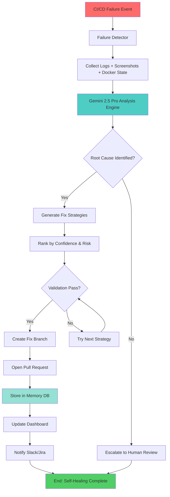

# GeminiGuard: Autonomous Self-Healing CI/CD Agent

```
 ██████╗ ███████╗███╗   ███╗██╗███╗   ██╗██╗ ██████╗ ██╗   ██╗ █████╗ ██████╗ ██████╗ 
██╔════╝ ██╔════╝████╗ ████║██║████╗  ██║██║██╔════╝ ██║   ██║██╔══██╗██╔══██╗██╔══██╗
██║  ███╗█████╗  ██╔████╔██║██║██╔██╗ ██║██║██║  ███╗██║   ██║███████║██████╔╝██║  ██║
██║   ██║██╔══╝  ██║╚██╔╝██║██║██║╚██╗██║██║██║   ██║██║   ██║██╔══██║██╔══██╗██║  ██║
╚██████╔╝███████╗██║ ╚═╝ ██║██║██║ ╚████║██║╚██████╔╝╚██████╔╝██║  ██║██║  ██║██████╔╝
 ╚═════╝ ╚══════╝╚═╝     ╚═╝╚═╝╚═╝  ╚═══╝╚═╝ ╚═════╝  ╚═════╝ ╚═╝  ╚═╝╚═╝  ╚═╝╚═════╝ 
```

🛡️ **Your CI/CD Pipeline's Autonomous Guardian**

[](https://www.python.org/)
[](https://ai.google.dev/)
[](LICENSE)
[](https://github.com/iampraveen6/GeminiGuard-Autonomous-Self-Healing-CI-CD-Agent/issues)
[](https://github.com/iampraveen6/GeminiGuard-Autonomous-Self-Healing-CI-CD-Agent/fork)
[](https://github.com/iampraveen6/GeminiGuard-Autonomous-Self-Healing-CI-CD-Agent/stargazers)

**Detects failures. Diagnoses root causes. Generates fixes. Opens PRs. Learns from every mistake.**

## 📋 Table of Contents

- [Why GeminiGuard?](#why-geminiguard)
- [Key Features](#key-features)
- [How It Works](#how-it-works)
- [Architecture](#architecture)
- [Prerequisites](#prerequisites)
- [Quick Start](#quick-start)
- [Configuration](#configuration)
- [Cost Transparency](#cost-transparency)
- [Integrations](#integrations)
- [Dashboard](#dashboard)
- [Usage Examples](#usage-examples)
- [Troubleshooting](#troubleshooting)
- [FAQ](#faq)
- [Contributing](#contributing)
- [Roadmap](#roadmap)
- [License](#license)
- [Star History](#star-history)

---

## Why GeminiGuard?

### The Problem

CI/CD pipelines fail. Every. Single. Day. And when they do, someone has to:

1. 🚨 Get paged at 2 AM
2. 📖 Dig through thousands of log lines
3. 🤔 Guess what went wrong
4. 🔧 Manually patch the issue
5. 🔄 Watch it break again next week

### The Solution

GeminiGuard automates the entire debugging workflow:

| Challenge | GeminiGuard Approach |
|-----------|---------------------|
| Scroll through 10,000 lines of logs | Analyzes logs, screenshots, and Docker state in seconds |
| Guess the root cause | Pinpoints the exact issue with confidence scoring |
| Manually patch and pray | Generates fixes, validates them, and opens PRs |
| Same bug breaks again next week | Remembers every failure and prevents regressions |

**Unlike other tools** that only comment on PRs, GeminiGuard:
- ✅ Creates actual fix branches and opens real PRs
- ✅ Tracks every API dollar spent with real-time cost transparency
- ✅ Builds a searchable memory of past failures to improve over time
- ✅ Never pushes to main without validation

---

## Key Features

| Feature | Description |
|---------|-------------|
| 🔍 **Multi-Modal Analysis** | Reads logs, test outputs, Docker states, and UI screenshots |
| 🤖 **Autonomous PR Generation** | Creates fix branches and opens pull requests automatically |
| 📊 **Smart Fix Ranking** | Ranks fixes by confidence score, risk level, and blast radius |
| 🔐 **Safe Execution** | Dry-run mode, rollback-ready, never auto-pushes to main |
| 🧠 **Self-Learning Memory** | Vector DB stores every failure → fix pair for future prevention |
| 💰 **Cost Transparency** | Real-time API cost tracking per operation, per pipeline |
| 📈 **Streamlit Dashboard** | Live observability into agent decisions and pipeline health |
| 🔌 **Slack & Jira Integration** | Instant alerts, automatic ticket creation, threaded discussions |
| 🛠️ **Multi-CI Support** | Works with GitHub Actions, GitLab CI, and more (expanding) |

---

## How It Works

```
Pipeline Fails
    ↓
[1] Failure Detector triggers
    ↓
[2] Collect logs, screenshots, Docker state
    ↓
[3] Gemini 2.5 Pro analyzes (multi-modal AI)
    ↓
[4] Root cause identified with confidence score
    ↓
[5] Generate 3-5 fix strategies ranked by risk/confidence
    ↓
[6] Validate fix in dry-run mode
    ↓
[7] If validation passes:
    ├→ Create fix branch
    ├→ Open pull request
    ├→ Store failure/fix pair in memory DB
    └→ Notify via Slack/Jira
    ↓
[8] If validation fails:
    └→ Try next strategy or escalate to human
    ↓
[9] Store learnings in memory for future reference
```

---

## Architecture



---

## Prerequisites

Before you begin, ensure you have:

- **Python 3.9 or higher**
- **Git** (for cloning and PR operations)
- **Google Gemini API Key** (free tier available at [ai.google.dev](https://ai.google.dev/))
- **GitHub Personal Access Token** (for PR creation) or **GitLab token** (for GitLab CI)
- **Docker** (optional, for Docker state analysis)
- **Slack Webhook URL** (optional, for notifications)
- **Jira credentials** (optional, for ticket creation)

### Get Your API Keys

1. **Google Gemini API**: Visit [ai.google.dev](https://ai.google.dev/), sign in with your Google account, and create an API key (free tier includes 60 requests/minute)

2. **GitHub Token**: Go to Settings → Developer settings → Personal access tokens → Generate new token with `repo` and `workflow` scopes

3. **Slack Webhook** (optional): Create an incoming webhook in your Slack workspace

4. **Jira API Token** (optional): Generate from your Jira account settings

---

## Quick Start

### 1. Clone the Repository

```bash
git clone https://github.com/iampraveen6/GeminiGuard-Autonomous-Self-Healing-CI-CD-Agent.git
cd GeminiGuard-Autonomous-Self-Healing-CI-CD-Agent
```

### 2. Install Dependencies

```bash
pip install -r requirements.txt
```

Or with dev dependencies for contributions:

```bash
pip install -r requirements-dev.txt
```

### 3. Configure Environment Variables

```bash
cp .env.example .env
```

Edit `.env` with your credentials:

```env
# ========== REQUIRED ==========
GEMINI_API_KEY=your_gemini_api_key_here
GITHUB_TOKEN=ghp_your_github_token_here
GITHUB_REPO_OWNER=your_github_username
GITHUB_REPO_NAME=your_repo_name

# ========== OPTIONAL ==========
# Slack Integration
SLACK_WEBHOOK_URL=https://hooks.slack.com/services/YOUR/WEBHOOK/URL

# Jira Integration
JIRA_BASE_URL=https://your-domain.atlassian.net
JIRA_EMAIL=your-email@example.com
JIRA_API_TOKEN=your_jira_api_token

# Agent Behavior
GEMINIGUARD_DRY_RUN=true              # true for testing, false for production
GEMINIGUARD_MAX_COST_USD=5.00         # Auto-stop if cost exceeds this
GEMINIGUARD_CONFIDENCE_THRESHOLD=0.85 # Minimum confidence to auto-fix (0-1)
GEMINIGUARD_LOG_LEVEL=INFO            # DEBUG, INFO, WARNING, ERROR

# Advanced
GEMINIGUARD_MEMORY_TYPE=chromadb      # chromadb, weaviate, pinecone
GEMINIGUARD_MAX_PARALLEL_FIXES=3      # Number of fix strategies to try in parallel
```

### 4. Run Your First Analysis

```bash
# Analyze a failed CI log file
python -m geminiguard analyze --log-file ./sample-failure.log --screenshot ./error.png

# Or start the dashboard (opens at http://localhost:8501)
streamlit run dashboard/app.py

# Or run as a background service
python -m geminiguard daemon
```

---

## Configuration

### GitHub Actions Integration

Add this workflow file to `.github/workflows/geminiguard.yml`:

```yaml
name: GeminiGuard Self-Healing

on:
  workflow_run:
    workflows: ["CI", "Tests"]
    types: [completed]

jobs:
  geminiguard-heal:
    if: ${{ github.event.workflow_run.conclusion == 'failure' }}
    runs-on: ubuntu-latest
    permissions:
      contents: write
      pull-requests: write
    steps:
      - uses: actions/checkout@v4
        with:
          token: ${{ secrets.GITHUB_TOKEN }}
      
      - name: Set up Python
        uses: actions/setup-python@v4
        with:
          python-version: '3.11'
      
      - name: Install GeminiGuard
        run: |
          pip install geminiguard
      
      - name: Run GeminiGuard Analysis
        uses: iampraveen6/geminiguard-action@v1
        with:
          gemini-api-key: ${{ secrets.GEMINI_API_KEY }}
          github-token: ${{ secrets.GITHUB_TOKEN }}
          dry-run: false  # Set to true for testing
          confidence-threshold: 0.85
        env:
          SLACK_WEBHOOK_URL: ${{ secrets.SLACK_WEBHOOK_URL }}
          JIRA_API_TOKEN: ${{ secrets.JIRA_API_TOKEN }}
```

### GitLab CI Integration

Add this to `.gitlab-ci.yml`:

```yaml
geminiguard_heal:
  stage: .post
  image: python:3.11
  script:
    - pip install geminiguard
    - geminiguard analyze --ci-provider gitlab --pipeline-id $CI_PIPELINE_ID
  rules:
    - if: $CI_PIPELINE_SOURCE == "push" && $CI_COMMIT_BRANCH
      when: on_failure
  artifacts:
    reports:
      dotenv: geminiguard-results.env
  allow_failure: true
```

### Advanced Configuration

Create a `geminiguard.yaml` for fine-grained control:

```yaml
agent:
  confidence_threshold: 0.85
  max_cost_usd: 5.00
  dry_run: false
  memory_retention_days: 90

analysis:
  extract_logs: true
  capture_screenshots: true
  docker_state: true
  git_diff: true

fix_generation:
  strategies_count: 5
  parallel_validation: true
  rollback_on_failure: true

integrations:
  slack:
    enabled: true
    notify_on: ["fix_generated", "pr_opened", "memory_hit"]
  jira:
    enabled: true
    auto_create_tickets: true
  github:
    enabled: true
    target_branch: main
    require_approval: false  # Set true for prod
```

---

## Cost Transparency

All API calls are logged with real-time cost tracking. Costs shown are based on **Google Gemini 2.5 Pro pricing (June 2026)**.

### Typical Operation Costs

| Operation | Input Tokens | Output Tokens | Est. Cost (USD) |
|-----------|--------------|---------------|-----------------|
| Log Analysis (10K lines) | ~15K | ~2K | $0.08 |
| Screenshot + Log Diagnosis | ~25K (multimodal) | ~3K | $0.15 |
| Fix Generation (single strategy) | ~8K | ~4K | $0.06 |
| Fix Ranking (3 strategies) | ~20K | ~1K | $0.05 |
| **Full Pipeline (avg. failure)** | **~50K** | **~10K** | **~$0.35** |
| Complex Multi-File Bug | ~100K | ~20K | ~$0.75 |

**Monthly Cost Estimate** (assuming 10 failures/day):
```
10 failures/day × $0.35/failure × 30 days = $105/month
```

### Cost Optimization Tips

1. **Enable Dry-Run Mode** during initial setup (no token cost for PR operations)
2. **Set `GEMINIGUARD_CONFIDENCE_THRESHOLD=0.90`** to avoid low-confidence (wasteful) analyses
3. **Use `GEMINIGUARD_MAX_COST_USD=50`** to auto-stop if daily costs spike
4. **Cache logs** to avoid re-analyzing identical failures
5. **Fine-tune prompts** to reduce output token count

View detailed costs in the dashboard under **Cost Analytics** tab.

---

## Integrations

### Supported Platforms

| Platform | Status | Setup Time | Notes |
|----------|--------|-----------|-------|
| **GitHub Actions** | ✅ Ready | 5 min | Use provided workflow template |
| **GitLab CI** | ✅ Ready | 5 min | Add .gitlab-ci.yml snippet |
| **Slack** | ✅ Ready | 2 min | Add webhook URL to .env |
| **Jira** | ✅ Ready | 3 min | Add credentials to .env |
| **Azure DevOps** | 🔄 In Progress | Q3 2026 | See Roadmap |
| **CircleCI** | 🔄 In Progress | Q3 2026 | See Roadmap |
| **PagerDuty** | 📋 Planned | Q4 2026 | Incident escalation |

### Setup Examples

#### Slack Notification

GeminiGuard automatically sends detailed Slack messages when:
- A fix is generated (with confidence score and risk assessment)
- A PR is opened (with link to dashboard)
- A regression is prevented (from memory DB)
- Cost thresholds are exceeded

```
✅ GeminiGuard Self-Healing Summary

🔍 Root Cause: Database connection timeout (port 5432 unreachable)
📊 Confidence: 94%
⚡ Fix Generated: Increase connection timeout from 5s → 30s
💰 Cost: $0.12
🔗 PR: #1245 | Dashboard: [link]
```

#### Jira Ticket Auto-Creation

When a fix is generated, GeminiGuard creates a Jira ticket with:
- Automatic title: `[GeminiGuard] Fix: {root_cause}`
- Description with: logs, root cause analysis, proposed fix, confidence score
- Labels: `geminiguard`, `auto-generated`
- Links to the PR and dashboard

---

## Dashboard

Launch the real-time Streamlit dashboard:

```bash
streamlit run dashboard/app.py
```

### Detailed Setup and Run

```bash
source venv/bin/activate
port PYTHONPATH=$(pwd)
export TEST_MODE=false

python3 -m pip install -r requirements.txt \
  --no-cache-dir \
  --trusted-host pypi.org \
  --trusted-host files.pythonhosted.org \
  --trusted-host pypi.python.org

python3 -m pip install requests \
  --no-cache-dir \
  --trusted-host pypi.org \
  --trusted-host files.pythonhosted.org \
  --trusted-host pypi.python.org

sudo kill -9 $(sudo lsof -t -i:8501) 2>/dev/null || true

python3 -m streamlit run dashboard/app.py --server.port 8501
```

### Dashboard Features

**🏠 Home**
- Quick stats: Total failures detected, success rate, avg. fix time
- Recent activity feed
- Quick access to recent failures

**📊 Pipeline Health**
- Failure trends over time (hourly, daily, weekly)
- Failure rate by service/component
- Top failure categories
- MTTR (Mean Time To Recovery) metrics

**💰 Cost Analytics**
- Real-time cost tracking
- Cost per failure
- Cost by operation type
- Daily/monthly budgets and alerts

**🧠 Memory Browser**
- Search past failures and their fixes
- View similarity scores (e.g., "This failure is 87% similar to #342 on 2026-06-15")
- One-click "Apply Previous Fix" for recurring issues

**📋 Decision Audit Trail**
- Why was Fix A chosen over Fix B?
- Confidence scores for each strategy
- Risk assessment details
- Token usage breakdown

**🔧 Integration Status**
- GitHub: Connected ✅ | Latest sync: 2 min ago
- Slack: Connected ✅ | Last notification: 1 hour ago
- Jira: Connected ❌ | Error: Invalid token

**⚙️ Settings**
- API key management
- Threshold adjustments
- Integration toggles
- Log level control

---

## Usage Examples

### Example 1: Auto-Fix a Dependency Conflict

**Failure Log:**
```
ERROR: incompatible dependency versions
- requests==2.28.0 requires urllib3<2.0, got 2.1.0
```

**GeminiGuard Output:**
```
🔍 Root Cause: Transitive dependency conflict
📊 Confidence: 96%
✅ Fix: Update requests to >=2.30.0 in requirements.txt
💼 Strategy: Bump to compatible version
⏱️ Time Taken: 8 seconds
💰 Cost: $0.08
```

**PR Generated:** `fix/dependency-conflict-requests` → main

---

### Example 2: Recover from Database Migration Failure

**Failure Log:**
```
ERROR: Alembic migration failed
FAILED: 001_add_users_table.py (Column 'email' cannot be NULL)
```

**GeminiGuard Output:**
```
🔍 Root Cause: Missing NOT NULL constraint in migration
📊 Confidence: 91%
✅ Fix: Add constraint check in Alembic script
💼 Strategies Considered:
   1. Add column constraint (Confidence: 91%) ← Selected
   2. Alter existing table (Confidence: 82%)
   3. Rollback and recreate (Confidence: 72%)
⏱️ Time Taken: 12 seconds
💰 Cost: $0.15
```

**Actions Taken:**
- Created fix branch
- Opened PR with detailed explanation
- Posted to Slack #deployments channel
- Linked to similar past failure (2024-05-12)

---

### Example 3: Debugging a Flaky Test

**Failure Pattern:**
```
Tests pass locally, fail in CI 40% of the time
Error: Race condition in async test suite
```

**GeminiGuard Analysis:**
```
🔍 Root Cause: Missing await on async fixture
📊 Confidence: 88%
🧠 Memory Hit: 3 similar failures fixed before
   - 2026-05-20: Same pattern, same fix successful
   - 2026-04-10: Identical issue
✅ Fix Applied: Add asyncio.gather() to test setup
💼 Learning Stored: "Flaky async tests → missing await"
```

---

## Troubleshooting

### Common Issues

#### 1. "GEMINI_API_KEY not found"

```
❌ Error: GEMINI_API_KEY environment variable not set

✅ Solution:
   a) Create .env file with: GEMINI_API_KEY=your_key
   b) Or export: export GEMINI_API_KEY=your_key
   c) Or set in GitHub Secrets
```

#### 2. "GitHub token insufficient permissions"

```
❌ Error: Token lacks 'workflow' or 'pull-requests' scopes

✅ Solution:
   a) Go to GitHub Settings → Developer settings → Personal access tokens
   b) Edit token → Enable 'repo' and 'workflow' scopes
   c) Regenerate and update .env
```

#### 3. "Dry-run mode: PR not created"

This is expected! Dry-run mode validates the fix without actually creating PRs.

```bash
# To enable live PR creation:
# In .env: GEMINIGUARD_DRY_RUN=false
# Or: python -m geminiguard analyze --log-file log.txt --dry-run=false
```

#### 4. "Cost exceeded maximum budget"

```
⚠️ Warning: Operation cost $1.20 exceeds max $1.00

✅ Solutions:
   a) Increase GEMINIGUARD_MAX_COST_USD limit
   b) Lower log file size (truncate old logs)
   c) Reduce screenshot resolution
   d) Increase GEMINIGUARD_CONFIDENCE_THRESHOLD to skip low-confidence fixes
```

#### 5. "Memory database connection failed"

```bash
# If using local ChromaDB:
# 1. Ensure persistent storage directory exists:
mkdir -p ./geminiguard_memory

# 2. Check file permissions:
chmod 755 ./geminiguard_memory

# 3. Restart GeminiGuard
python -m geminiguard daemon
```

### Enable Debug Logging

```bash
# In .env:
GEMINIGUARD_LOG_LEVEL=DEBUG

# Or:
python -m geminiguard analyze --log-file fail.log --debug
```

---

## FAQ

### Q: Will GeminiGuard push directly to main?

**A:** No. By design, GeminiGuard:
- Creates fix branches (never main)
- Opens PRs for human review
- Requires branch protection rules (recommended)
- Can be configured to require approval before merge

### Q: What if a fix causes a new failure?

**A:** GeminiGuard detects this and:
- Automatically reverts the PR
- Tries the next-ranked fix strategy
- Logs the learning: "This fix made things worse"
- Stores in memory to avoid future attempts

### Q: How much will this cost my CI/CD?

**A:** Depends on failure frequency:
- 1 failure/day = ~$10.50/month
- 10 failures/day = ~$105/month
- 100 failures/day = ~$1,050/month (consider why so many failures!)

All operations are logged with costs visible in the dashboard.

### Q: Can I integrate with my custom CI/CD system?

**A:** Yes! GeminiGuard supports:
- GitHub Actions (native)
- GitLab CI (native)
- Any CI that can run Python (generic API mode)

For custom systems, use:
```bash
python -m geminiguard analyze \
  --log-file /var/log/ci/latest.log \
  --screenshot /tmp/error.png \
  --metadata ci_provider=custom
```

### Q: How does the "memory" system work?

**A:** GeminiGuard uses a vector database to store:
- Every failure (logs, screenshots, metadata)
- Every fix applied
- Success/failure outcome

When new failures occur, it searches for similar past failures (~87% match = "similar") and suggests the previously-successful fix.

### Q: Is GeminiGuard GDPR/SOC2 compliant?

**A:** It depends on your deployment:
- **Using Google Gemini API**: Logs are sent to Google. Ensure your logging policy permits this.
- **Self-hosted memory DB**: Data stays on your infrastructure.

For enterprise deployments, consider:
- On-premise vector DB (Weaviate, Milvus)
- Private Gemini API endpoints (if available)

### Q: Can I use this in production?

**A:** Yes, with proper safeguards:
1. ✅ Start with `GEMINIGUARD_DRY_RUN=true`
2. ✅ Test with low-traffic branches first
3. ✅ Enable Slack/Jira notifications
4. ✅ Set `require_approval: true` in PR settings
5. ✅ Monitor the dashboard for first week
6. ✅ Gradually increase `confidence_threshold` as you gain trust

---

## Contributing

We love contributions! Whether it's bug fixes, new features, or documentation improvements.

### Getting Started

```bash
# Fork the repo and clone
git clone https://github.com/YOUR_USERNAME/GeminiGuard-Autonomous-Self-Healing-CI-CD-Agent.git
cd GeminiGuard-Autonomous-Self-Healing-CI-CD-Agent

# Create a feature branch
git checkout -b feature/amazing-feature

# Install dev dependencies
pip install -r requirements-dev.txt

# Make your changes and run tests
pytest tests/ -v --cov=geminiguard

# Lint your code
black geminiguard/ tests/
flake8 geminiguard/ tests/

# Commit with conventional commits
git commit -m "feat(analyzer): add support for custom log formats"

# Push and create a PR
git push origin feature/amazing-feature
```

### Code Style

- Follow [Black](https://black.readthedocs.io/) for Python formatting
- Use [type hints](https://docs.python.org/3/library/typing.html) for all functions
- Write docstrings in [Google style](https://google.github.io/styleguide/pyguide.html#38-comments-and-docstrings)
- Maintain >85% test coverage

### Testing

```bash
# Run all tests
pytest tests/

# Run specific test file
pytest tests/test_analyzer.py -v

# Run with coverage
pytest tests/ --cov=geminiguard --cov-report=html
```

---

## Roadmap

- [x] Multi-modal analysis (logs + screenshots + Docker state)
- [x] Autonomous PR generation
- [x] Slack & Jira integration
- [x] Cost transparency dashboard
- [x] Self-learning memory system
- [ ] **Azure DevOps support** (Q3 2026)
- [ ] **CircleCI & TravisCI integration** (Q3 2026)
- [ ] **Custom fix strategy plugins** (Q4 2026)
- [ ] **Team-wide knowledge base sharing** (Q4 2026)
- [ ] **Enterprise SSO & RBAC** (Q1 2027)
- [ ] **Kubernetes cluster health analysis** (Q1 2027)
- [ ] **Performance regression detection** (Q2 2027)

---

## License

Distributed under the **MIT License**. See [LICENSE](LICENSE) file for details.

---

## Star History

<a href="https://www.star-history.com/?repos=iampraveen6%2FGeminiGuard-Autonomous-Self-Healing-CI-CD-Agent&type=timeline&legend=top-left">
  <picture>
    <source media="(prefers-color-scheme: dark)" srcset="https://api.star-history.com/chart?repos=iampraveen6/GeminiGuard-Autonomous-Self-Healing-CI-CD-Agent&type=timeline&theme=dark&logscale&legend=top-left" />
    <source media="(prefers-color-scheme: light)" srcset="https://api.star-history.com/chart?repos=iampraveen6/GeminiGuard-Autonomous-Self-Healing-CI-CD-Agent&type=timeline&logscale&legend=top-left" />
    
  </picture>
</a>

---

## Built With ❤️

- [Google Gemini 2.5 Pro](https://ai.google.dev/) - Multi-modal AI analysis
- [ChromaDB](https://www.trychroma.com/) - Self-learning memory system
- [Streamlit](https://streamlit.io/) - Real-time dashboard
- [PyGithub](https://pygithub.readthedocs.io/) - GitHub integration
- [Python-Gitlab](https://python-gitlab.readthedocs.io/) - GitLab integration

---

## Connect With Us

- 🐙 **GitHub**: [iampraveen6](https://github.com/iampraveen6)
- 💼 **LinkedIn**: [linkedin.com/in/iampraveen6](https://linkedin.com/in/iampraveen6)
- 🐦 **Twitter**: [@iampraveen6](https://twitter.com/iampraveen6)

---

<div align="center">

**⭐ If you found GeminiGuard helpful, please star the repo!**

Questions? Open an [issue](https://github.com/iampraveen6/GeminiGuard-Autonomous-Self-Healing-CI-CD-Agent/issues) or start a [discussion](https://github.com/iampraveen6/GeminiGuard-Autonomous-Self-Healing-CI-CD-Agent/discussions).

</div>
